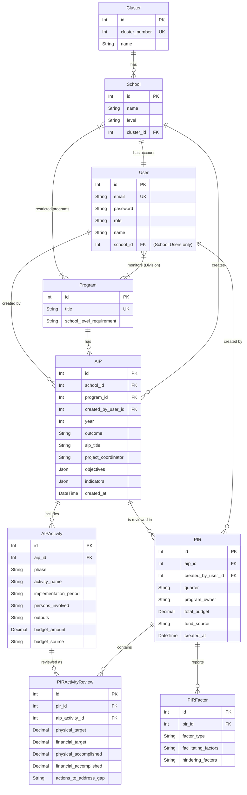

# Database Schema & ERD

## Overview

This document outlines the Database Schema and Entity-Relationship Diagram (ERD) used for the AIP-PIR web application. 

## Technology Stack

The application's technology stack comprises the following:
- **Database:** PostgreSQL
- **ORM:** Prisma (with driverAdapters preview feature)
- **Backend Environment:** Deno with Hono web framework
- **Frontend Environment:** React 19 (via Vite)
- **Styling:** Tailwind CSS (v4)
- **Language:** TypeScript (backend) / JavaScript (frontend)

## Entity Relationship Diagram (ERD)

## Schema Details

### 1. **Cluster**
Represents a group of schools.
- `id`: Unique identifier.
- `cluster_number`: Unique cluster identifier number.
- `name`: Name of the cluster.

### 2. **User**
Represents an individual authenticating into the system.
- `id`: Unique identifier.
- `email`: Unique email address used for login.
- `password`: Bcrypt-hashed password.
- `role`: `"School"` or `"Division Personnel"`.
- `name`: Display name of the user.
- `school_id`: Foreign key to **School** — present only for School-role users (1-to-1). Null for Division Personnel.
- **Relations**: Many-to-many with **Program** (Division Personnel program assignments via `_UserPrograms` junction table).

### 3. **School**
Represents a physical or conceptual educational institution.
- `id`: Unique identifier.
- `name`: Name of the school.
- `level`: School's education level (`"Elementary"`, `"Secondary"`, `"Both"`).
- `cluster_id`: Foreign key reference to the associated **Cluster**.
- **Relations**: Many-to-many with **Program** for restricted programs (e.g., ALS) via `_RestrictedPrograms` junction table.

### 4. **Program**
Represents a specific educational or improvement program.
- `id`: Unique identifier.
- `title`: Unique title of the program.
- `school_level_requirement`: Requirement criteria (`"Elementary"`, `"Secondary"`, `"Both"`, `"Select Schools"`).

### 5. **AIP (Annual Implementation Plan)**
Central model representing an implementation plan for a given school (or Division Personnel), program, and year.
- **Uniqueness Constraints**: Restricted to one AIP per school, program, and year scenario.
- `created_by_user_id`: Foreign key to **User** — tracks document ownership for access control. Required for Division Personnel isolation (School Users set this to their own user ID).
- `outcome`: DepEd Outcome Category for this AIP.
- Fields manage plan specifics like `sip_title`, `project_coordinator`, `objectives` (JSON array), and `indicators` (JSON array).

### 6. **AIPActivity**
Activities associated with a specific AIP, segmented by phase.
- `phase`: One of `"Planning"`, `"Implementation"`, or `"Monitoring and Evaluation"`.
- `implementation_period`: The execution window for this activity (e.g., `"Q1"`, `"January–March"`, `"Whole Year"`). This field is automatically surfaced in the PIR form when activities are pre-populated from the linked AIP.
- Tracks the `budget_amount` and expected `outputs` for each activity.

### 7. **PIR (Program Implementation Review)**
A quarterly evaluation report for a given AIP.
- **Uniqueness Constraints**: Only one PIR can be submitted per quarter per AIP.
- `created_by_user_id`: Foreign key to **User** — tracks document ownership, mirroring the AIP ownership pattern.
- Tracks total actual budget (`total_budget`), `fund_source`, and `program_owner`.

### 8. **PIRActivityReview**
Physical and financial target review of a specific AIP Activity within a given PIR.
- **Uniqueness Constraints**: An activity can only be reviewed once per PIR.
- References `aip_activity_id` directly — activity name and `implementation_period` are sourced from the linked `AIPActivity` record, not duplicated here.
- Compares physical/financial targets against actual accomplishments.

### 9. **PIRFactor**
Facilitating and hindering factors influencing PIR outcomes.
- Factor types: `"Institutional"`, `"Technical"`, `"Infrastructure"`, `"Learning Resources"`, `"Environmental"`, `"Others"`.
- **Uniqueness Constraints**: Only one factor block of each type is tracked per PIR.
