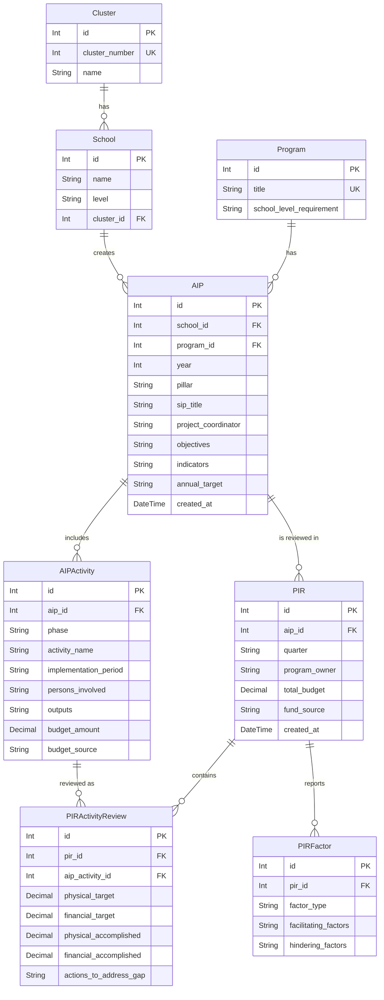

# Database Schema & ERD

## Overview

This document outlines the Database Schema and Entity-Relationship Diagram (ERD) used for the AIP-PIR web application. 

## Technology Stack

The application's technology stack comprises the following:
- **Database:** SQLite
- **ORM:** Prisma
- **Backend Environment:** Node.js with Express.js
- **Frontend Environment:** React (via Vite)
- **Styling:** Tailwind CSS (v4)
- **Language:** JavaScript

## Entity Relationship Diagram (ERD)

## Schema Details

### 1. **Cluster**
Represents a group of schools.
- `id`: Unique identifier.
- `cluster_number`: Unique cluster identifier number.
- `name`: Name of the cluster.

### 2. **School**
Represents a school entity.
- `id`: Unique identifier.
- `name`: Name of the school.
- `level`: School's education level ("Elementary", "Secondary", "Both").
- `cluster_id`: Foreign key reference to the associated **Cluster**.

### 3. **Program**
Represents a specific educational or improvement program.
- `id`: Unique identifier.
- `title`: Unique title of the program.
- `school_level_requirement`: Requirement criteria ("Elementary", "Secondary", "Both", "Select Schools").

### 4. **AIP (Annual Implementation Plan)**
Central model representing an implementation plan submitted by a school for a given program and year.
- **Uniqueness Constraints**: Restricted to one AIP per school, program, and year scenario.
- Fields manage plan specifics like `pillar`, `sip_title`, `project_coordinator`, and key indicators.

### 5. **AIPActivity**
Activities associated with a specific AIP.
- `phase`: Follows periods like "Planning", "Implementation", or "Monitoring and Evaluation".
- Tracks the `budget_amount` and expected outputs for each activity.

### 6. **PIR (Program Implementation Review)**
A review conducted typically on a quarterly basis for a given AIP.
- **Uniqueness Constraints**: Only one PIR can be submitted per quarter specific to an individual AIP.
- Tracks total actual budget and `program_owner`.

### 7. **PIRActivityReview**
A financial and physical target review of a specific AIP Activity conducted within a given PIR.
- **Uniqueness Constraints**: An activity can only be reviewed once per PIR.
- Evaluates constraints by comparing physical and financial targets against what was functionally accomplished.

### 8. **PIRFactor**
Various factors influencing the PIR outcomes.
- Summarizes facilitating (helpful) and hindering (bottleneck) aspects.
- Factor types include "Institutional", "Technical", "Infrastructure", "Learning Resources", "Environmental", and "Others".
- **Uniqueness Constraints**: Only one factor block of each type is securely tracked per PIR.
