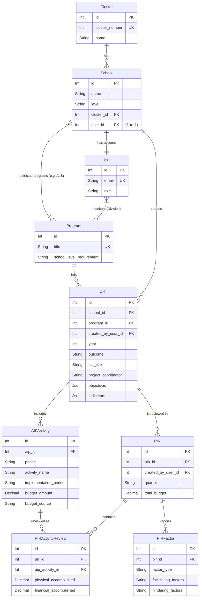

# System Documentation: AIP-PIR
## Stage 1: Introduction & System Architecture

---

## Chapter 1: Introduction

### 1.1 Background of the Study
The Department of Education (DepEd) mandates robust planning and evaluation mechanisms to ensure the delivery of quality basic education. The **Annual Implementation Plan (AIP)** serves as the strategic blueprint for schools, outlining specific projects, budgetary requirements, and implementation timelines for a given fiscal year. Concurrently, the **Program Implementation Review (PIR)** is the quarterly evaluation mechanism used to assess physical and financial accomplishments against the targets set in the AIP.

Historically, the consolidation and tracking of AIPs and PIRs across the Division of Guihulngan City have relied on fragmented, manual, or decentralized spreadsheet-based systems. These traditional methods are susceptible to data silos, delayed reporting, and difficulties in enforcing strict bureaucratic workflows (e.g., ensuring a school cannot submit a quarterly PIR without first having an approved AIP).

### 1.2 Objectives of the System
The **AIP-PIR Portal** is designed to digitize, standardize, and centralize the planning and review cycle. The specific objectives of this system are:
1. **Workflow Enforcement:** To programmatically enforce the dependency of the PIR upon the AIP, ensuring structural data integrity.
2. **Role-Based Access Control (RBAC):** To delineate the privileges of School-level users (data entry and submission) versus Division Personnel (monitoring and evaluation).
3. **Data Persistence & Draft Management:** To provide stateful form management, allowing users to save drafts and resume work, thereby reducing data loss during lengthy planning sessions.
4. **Automated Document Generation:** To dynamically generate print-ready, standardized DepEd-compliant documents directly from the database schema.

---

## Chapter 2: System Architecture & Technological Framework

The system utilizes a modern, decoupled client-server architecture. This approach separates the presentation layer (frontend) from the business logic and data persistence layer (backend), facilitating scalability, maintainability, and distinct security boundaries.

### 2.1 Presentation Layer: React 19 & Vite
The frontend is constructed as a Single Page Application (SPA) utilizing **React 19** and bundled via **Vite**. 

#### 2.1.1 Academic Justification (React & SPA)
React's component-based architecture promotes high modularity and reusability of User Interface (UI) elements. By managing a Virtual Document Object Model (Virtual DOM), React minimizes expensive direct DOM manipulations, resulting in highly performant updates—crucial for complex, highly interactive data-entry interfaces like the multi-phase AIP forms (Aggarwal, 2018). Furthermore, the SPA paradigm shifts the rendering workload to the client, reducing server overhead and providing a fluid, desktop-like user experience by avoiding full page reloads during navigation (Mesbah & van Deursen, 2007).

#### 2.1.2 Styling: Tailwind CSS v4
**Tailwind CSS** is utilized as the utility-first CSS framework. Unlike traditional semantic CSS, utility-first CSS provides low-level utility classes that allow for rapid UI construction directly within the markup. This approach enforces a strict design system, reduces CSS payload bloat (as only used classes are compiled), and mitigates the risk of CSS specificity conflicts in a large codebase.

### 2.2 Server Environment & Runtime: Deno
The backend API is powered by **Deno**, a modern runtime for JavaScript and TypeScript.

#### 2.2.1 Academic Justification (Deno)
Deno was selected over traditional Node.js for several architectural advantages:
1. **Secure by Default:** Deno executes code in a secure sandbox. Unlike Node.js, a Deno process requires explicit permission flags (e.g., `--allow-net`, `--allow-read`) to access the network or file system. This drastically reduces the attack surface, particularly regarding supply chain attacks via third-party dependencies (Dahl, 2018).
2. **Native TypeScript Support:** Deno compiles and executes TypeScript out of the box without requiring external transpilation steps (like `ts-node` or Webpack). This guarantees that the type-safety written during development is natively executed in production, reducing runtime type errors.
3. **Standard Web APIs:** Deno implements modern Web APIs (like `fetch`, `URL`, and `Crypto`) natively, aligning server-side JavaScript closer to standard browser environments.

### 2.3 Data Layer: PostgreSQL & Prisma ORM
Data persistence is handled by **PostgreSQL**, an advanced open-source relational database management system, mediated by the **Prisma** Object-Relational Mapper (ORM).

#### 2.3.1 Academic Justification (Relational Database)
Given the strict relational nature of the DepEd data—where a `User` belongs to a `School`, and a `School` generates a highly structured `AIP` containing multiple `Activities`—a relational schema (SQL) is significantly more appropriate than a NoSQL document store. PostgreSQL provides robust ACID (Atomicity, Consistency, Isolation, Durability) compliance, ensuring that complex multi-table inserts (e.g., saving an AIP with its nested objectives and activities) succeed or fail as a single atomic transaction.

#### 2.3.2 Academic Justification (Prisma ORM)
Prisma provides a type-safe data access layer. Traditional string-based SQL queries are prone to injection attacks and runtime errors due to schema mismatches. Prisma generates a strict TypeScript client directly from the database schema. This guarantees that any schema changes immediately trigger compile-time errors in the backend code if queries are not updated accordingly, drastically improving long-term application stability and developer velocity.

---

## References (Stage 1)
* Aggarwal, S. (2018). *Modern Web-Development using ReactJS*. International Journal of Recent Research Aspects, 5(1), 133-137.
* Dahl, R. (2018). *10 Things I Regret About Node.js*. JSConf EU.
* Mesbah, A., & van Deursen, A. (2007). *Migrating Multi-page Web Applications to Single-page AJAX Interfaces*. 11th European Conference on Software Maintenance and Reengineering (CSMR'07), 181-190.

# System Documentation: AIP-PIR
## Stage 2: Database Architecture & Data Modeling

---

## Chapter 3: Database & Data Modeling

The relational integrity of the AIP-PIR system is foundational to its ability to accurately track educational programs across multiple organizational levels (Schools and the Division Office). The data layer must enforce complex business rules, such as restricting access to specific programs (e.g., Alternative Learning System) to a subset of authorized schools.

### 3.1 Entity-Relationship (ER) Architecture
The database is modeled using a deeply relational approach to eliminate data redundancy and ensure referential integrity. The core entities govern users, their affiliations, and the highly structured forms they submit.

#### 3.1.1 Entity Relationship Diagram (ERD)

#### 3.1.2 Core Entities Mapping
1. **Cluster:** A macro-grouping of multiple schools.
2. **School Entity:** Represents a physical or conceptual educational institution. Associated with a `Cluster`.
3. **User Entity:** Represents an individual authenticating into the system via email.
   - *Relationship:* A `User` has a **One-to-One (1:1)** relationship with a `School` (for school-level users), ensuring a single point of accountability for data entry. Division Personnel users may not be directly tied to a single school.
4. **Program Entity:** Represents an educational initiative (e.g., SPED, ALS, Regular).
   - *Relationship:* A `School` has a **Many-to-Many (M:N)** relationship with `Program`. This is critical for access control; an `ALS` program entity is only linked to "Selected Schools", preventing unauthorized schools from generating ALS-specific AIPs.
   - *Relationship:* A `User` (specifically Division Personnel) has a **Many-to-Many (M:N)** relationship with `Program`, representing their monitoring assignments.
5. **AIP (Annual Implementation Plan) Entity:** The parent document for a given fiscal year, constrained to a unique combination of School, Program, and Year.
6. **AIPActivity Entity:** Activities segmented by phase (Planning, Implementation, Monitoring). Child to `AIP`.
7. **PIR (Program Implementation Review) Entity:** The evaluation report for a given quarter, strictly dependent on an approved parent `AIP`.
8. **PIRActivityReview & PIRFactor:** Highly granular evaluation metrics comparing the baseline `AIPActivity` against actual quarterly physical and financial accomplishments.

### 3.2 Database Normalization Strategy
The schema adheres closely to the **Third Normal Form (3NF)** to minimize duplication and avoid insertion/deletion anomalies (Codd, 1970).

1. **First Normal Form (1NF):** All attributes are atomic. For instance, rather than storing a comma-separated list of activity names in a single field, a distinct `AIPActivity` relational table is utilized.
2. **Second Normal Form (2NF):** All non-key attributes are fully functionally dependent on the primary key. E.g., The School Name depends exclusively on the `School ID`.
3. **Third Normal Form (3NF):** No transitive dependencies exist. The `Program` constraints are normalized out into junction tables (e.g., `_ProgramToSchool`), ensuring that modifying a program's metadata does not require cascading updates across all affiliated schools (Date, 2019).

### 3.3 Draft Persistence Modeling
A substantial challenge in extensive form-entry systems is session timeout or accidental navigation resulting in data loss. The database schema accommodates this via a dedicated Draft payload mechanism.

#### 3.3.1 Academic Justification (State Persistence)
Rather than relying purely on volatile client-side storage (e.g., `localStorage`), which restricts the user to a single device/browser session, the system implements API-driven server-side draft persistence. This allows the user to begin complex AIP data entry on a desktop, save the intermediate JSON state payload to the PostgreSQL database, and safely resume on a different device (Richardson & Ruby, 2008). 

---

## References (Stage 2)
* Codd, E. F. (1970). *A Relational Model of Data for Large Shared Data Banks*. Communications of the ACM, 13(6), 377-387.
* Date, C. J. (2019). *Database Design and Relational Theory: Normal Forms and All That Jazz* (2nd ed.). O'Reilly Media.
* Richardson, L., & Ruby, S. (2008). *RESTful Web Services*. O'Reilly Media.

# System Documentation: AIP-PIR
## Stage 3: Security & Role-Based Access Control

---

## Chapter 4: Authentication & Security Authorization

The security architecture of the AIP-PIR portal is built around the principles of Least Privilege and Separation of Concerns (Saltzer & Schroeder, 1975). Authorization—determining what an authenticated user is allowed to do—is strictly enforced at both the client layer (via React Router guards) and the server layer (via Deno middleware).

### 4.1 Authentication Mechanism (JWT)
The system utilizes **JSON Web Tokens (JWT)** for stateless session management. Upon successful credential verification, the Deno backend issues a cryptographically signed JWT to the client.

#### 4.1.1 Academic Justification (Stateless Auth)
Unlike traditional cookie-based sessions, which require the server to store session IDs in memory or a database (rendering the system stateful and harder to horizontally scale), JWTs are self-contained. The token intrinsically carries the user's encoded identity (`User ID`, `Role`, `School ID`). The server merely needs to verify the cryptographic signature against its secret key to validate an incoming request (Bradley et al., 2015). This decoupling prevents database bottlenecks during high-traffic periods, such as the mandated end-of-quarter PIR submission deadlines.

### 4.2 Role-Based Access Control (RBAC) Architecture
The system employs a strict RBAC model, delineating access into two primary user categories.

#### 4.2.1 The School User
- **Identifier Identifier:** Unique School ID mapped to an official DepEd email (e.g., `120233@deped.gov.ph`).
- **Authorization Boundary:** A School User is relationally bound to a single `School` entity. They are strictly authorized to generate, read, update, and submit data (AIP/PIR) *only* for their assigned institution.
- **Dynamic Program Constraints:** By default, School Users have access to standard overarching programs. However, specialized programs (like the Alternative Learning System, ALS) are structurally isolated via a many-to-many database relation. If a `School` entity is not explicitly linked to the `ALS Program` entity, the frontend UI will not render the ALS option, and the backend API will explicitly reject unexpected ALS data manipulation from that School User.

#### 4.2.2 The Division Personnel
- **Identifier:** Personnel Name mapped to an official email.
- **Authorization Boundary:** Division Personnel create and manage their own independent AIP and PIR documents at the Division level. Unlike School Users, they are not bound to a single `School` entity — their `school_id` is null. Document ownership is tracked via the `created_by_user_id` field on both `AIP` and `PIR`, ensuring a Division Personnel member can only read, update, or delete documents they themselves created.
- **Programmatic Scope:** Their access scope is bound by a many-to-many relationship to the `Program` entity (via the `_UserPrograms` junction table). A Division Personnel member assigned to monitor "SPED" (Special Education) can only create or access AIPs/PIRs for SPED-related submissions. Programs classified as `"Elementary"` or `"Secondary"` school-level (e.g., ALS) are excluded from Division Personnel access. This implements "Need-to-Know" data compartmentalization.
- **PIR Auto-Population:** When a Division Personnel member creates a PIR, the system automatically fetches the activity list from the linked AIP — including each activity's `implementation_period` — and pre-fills the PIR form with read-only activity records. This bridges the planning and evaluation cycle without requiring manual re-entry.

### 4.3 Client-Side Route Guards vs Server-Side Verification
While the React application employs Route Guards (e.g., redirecting an unauthenticated user away from the `/dashboard` to `/login`), this is acknowledged primarily as a User Experience (UX) optimization, not an impenetrable security barrier (OWASP, 2021). The definitive source of truth and security lies in the Deno backend. Every protected API endpoint sequentially extracts the JWT from the `Authorization: Bearer` header, verifies its integrity, parses the claimant's explicit Role, and cross-references it against the specific resource (School/Program ID) being updated before committing any database transactions via Prisma.

---

## References (Stage 3)
* Bradley, J., Jones, M., & Sakimura, N. (2015). *JSON Web Token (JWT)*. RFC 7519, Internet Engineering Task Force.
* OWASP Foundation. (2021). *OWASP Top 10: Broken Access Control*. Open Web Application Security Project.
* Saltzer, J. H., & Schroeder, M. D. (1975). *The Protection of Information in Computer Systems*. Proceedings of the IEEE, 63(9), 1278-1308.

# System Documentation: AIP-PIR
## Stage 4: Core Process Workflows

---

## Chapter 5: Process Modeling & System Workflows

The AIP-PIR portal essentially digitizes a highly structured bureaucratic workflow. The core objective of the system is not merely to capture data, but to mathematically and logically enforce the sequence of the DepEd planning and evaluation cycle.

### 5.1 The AIP-PIR Dependency Model
The most critical business rule within the Application Programming Interface (API) is the structural dependency of the Program Implementation Review (PIR) upon an approved Annual Implementation Plan (AIP).

#### 5.1.1 Process Enforcement
Academically, this models a strict **Precondition constraint** in business process management (Weske, 2012). A school cannot evaluate its quarterly physical and financial accomplishments (PIR) if it has not yet established its baseline targets and planned budget (AIP). 

Technically, this is implemented via a React `ProtectedRoute` variant (the `PIRRouteGuard`). When a School User attempts to access the `/pir` endpoint, the system automatically dispatches an asynchronous request to verify if an approved AIP exists for that specific `School ID` and the current Fiscal Year. If the boolean response is false, the UI explicitly locks the PIR module, rendering it grayscale and displaying an "AIP Submission Required" overlay. This prevents orphaned PIR data entries in the relational database.

### 5.2 Multi-Phase Activity Planning
The AIP Form module diverges from simple flat-file data entry by enforcing a phased chronological structure for all generated activities.

#### 5.2.1 Phase Logic
When a user defines an activity under an Objective, they must categorize it into one of three strict operational phases:
1. **Planning**
2. **Implementation**
3. **Monitoring and Evaluation (M&E)**

This phased approach, deeply rooted in Project Management Body of Knowledge (PMBOK) principles (Project Management Institute, 2021), forces educators to systematically break down their overarching SIP (School Improvement Plan) into actionable, chronologically sound steps, rather than a disorganized list of tasks. The generated `AIPDocument` (the print-ready component) dynamically groups and numbers activities based on these phases.

### 5.3 Draft Persistence & Stateful UX
Complex bureaucratic forms spanning multiple objectives and dozens of financial line items cannot reasonably be expected to be completed in a single session. Session timeouts or network interruptions could lead to catastrophic loss of user input.

#### 5.3.1 Technical Implementation
To mitigate this, the system leverages a hybridized auto-save architecture.
1. **Local State:** As the user interacts with the form, React's `useState` manages the immediate Virtual DOM, providing instantaneous feedback (e.g., dynamically totaling the `budgetAmount` across all activities).
2. **Server-Side Drafts:** An explicit "Save Draft" action serializes the entire complex React state object into a JSON payload. This payload is transmitted via a RESTful `POST` request to the Deno backend, where it is stored in a dedicated `Drafts` table (or filesystem, depending on exact implementation state). Upon subsequent logins, an initialization `GET` request retrieves this payload, seamlessly restoring the React state to its precise prior condition (Fowler, 2002).

---

## References (Stage 4)
* Fowler, M. (2002). *Patterns of Enterprise Application Architecture*. Addison-Wesley Professional.
* Project Management Institute. (2021). *A Guide to the Project Management Body of Knowledge (PMBOK Guide)* (7th ed.). Project Management Institute.
* Weske, M. (2012). *Business Process Management: Concepts, Languages, Architectures* (2nd ed.). Springer.

