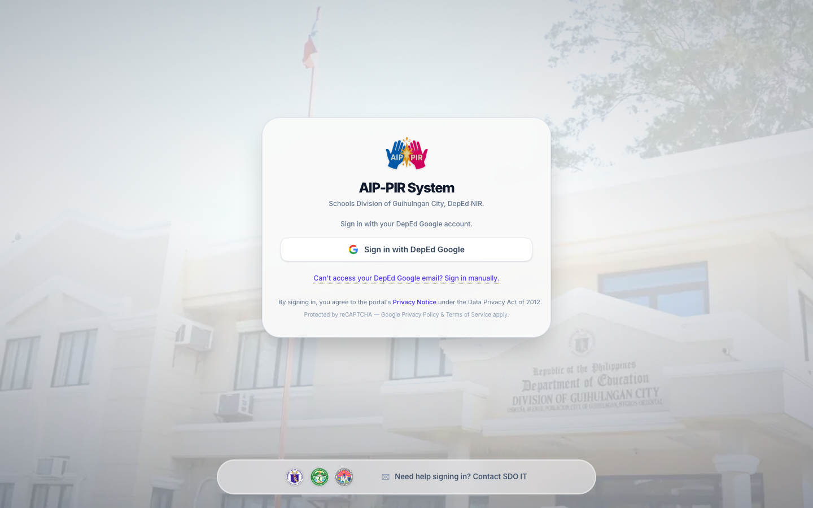

# AIP-PIR Portal User Manual
**Version:** 1.3.1-beta  
**Date:** June 16, 2026  
**Audience:** DepEd Division of Guihulngan City portal users  

> [!NOTE]
> This manual uses anonymized demo data for all screenshots. Real user data is strictly protected and never displayed in public documentation.

---

## Chapter 1: Introduction

The **AIP-PIR Portal** is the official electronic submission and review system for the Annual Implementation Plan (AIP) and Program Implementation Review (PIR) of the Schools Division of Guihulngan City.

- **AIP (Annual Implementation Plan):** Your school's roadmap of activities, goals, and budget for the year.
- **PIR (Program Implementation Review):** Your school's quarterly report of physical and financial accomplishments against the AIP.

**Why PIR depends on AIP:** The portal enforces a gated workflow. You cannot file a quarterly PIR unless you have an approved or accepted AIP in the system. The PIR pulls your activities, indicators, and targets directly from your approved AIP.

**Quarterly Reporting:** PIRs are filed every quarter during specific open windows determined by the Division Office.

**The Review Flow:** The portal uses a streamlined, cluster-less review chain:
`School submits -> Focal recommendation -> CES Reviewer -> Approved or Returned`

---

## Chapter 2: Account Access and Onboarding

### Signing In
Open the portal in any modern web browser.
1. **Google Sign-In:** If enabled, click "Sign in with DepEd Google" to securely log in using your `@deped.gov.ph` account.
2. **Email and Password:** If you do not have a DepEd Google account or if local network testing is active, click "Sign in manually" and enter your credentials.

*Figure 1. Login options screen showing Google and manual sign-in paths.*

*Figure 2. Manual sign-in form.*

### Onboarding
First-time users will be greeted by the **Complete Your Profile** wizard. 
- **School-Based Personnel:** Select your assigned school.
- **Division-Based Personnel:** Select your functional division.
> [!IMPORTANT]
> The onboarding wizard requires a desktop or laptop computer to ensure you can properly review your assignment details before confirmation.

---

## Chapter 3: Common Portal Controls

The portal features a consistent layout across all roles.

*Figure 3. The main dashboard overview showing standard navigation.*

- **Role-Aware Navigation:** The sidebar automatically adapts to show only the tools permitted for your role.
- **Reporting Period Picker:** Use the global picker at the top to switch between reporting years and quarters.
- **Notification Bell:** Receive alerts when your submissions are returned or approved.
- **Help & Accessibility:** Access the FAQ, guided tours, and accessibility controls (contrast, reduced motion) from the top right menu.

---

## Chapter 4: Roles, Permissions, and Workflow Statuses

### Roles
- **School:** Creates and submits AIPs and PIRs.
- **Division Personnel / Focal:** Recommends school submissions to the CES.
- **CES Reviewer:** Final approver for submissions (functional routing by SGOD, OSDS, CID).
- **Observer:** Read-only access to submissions and consolidation.
- **Admin:** Manages users, schools, programs, and system deadlines.

### Workflow Status Glossary
- **Draft:** Work in progress, only visible to the creator.
- **Submitted / For Recommendation:** Pending review by the Focal Person.
- **For CES Review:** Recommended by Focal, pending final approval.
- **Under Review:** Currently being evaluated by a reviewer.
- **Approved:** Finalized and locked.
- **Returned:** Sent back to the school for corrections.

---

## Chapter 5: School User Manual

### AIP Workspace
1. **Open AIP:** Click the AIP menu item.
2. **Select your program:** Choose the program you are planning for.
3. **Complete the forms:** Fill out the profile, goals, KPIs, action plan, and M&E activities.
4. **Submit for review:** After signing, click Submit. The status will change to *For Recommendation*.

*Figure 4. School dashboard showing the next required action.*

*Figure 5. The AIP program selection screen.*

### PIR Workspace
> [!WARNING]
> You cannot access the PIR workspace until your AIP is Approved.

1. **Open PIR:** Navigate to the PIR menu.
2. **Select Program and Quarter:** Choose the period to report on.
3. **Accomplishments:** Enter physical and financial accomplishments for your AIP-derived activities.
4. **Factors & Ways Forward:** Document facilitating/hindering factors and action items.
5. **Submit:** Submit your PIR for focal review.

*Figure 6. The PIR reporting workspace.*

If your submission is **Returned**, read the reviewer remarks at the top of the document, make the necessary edits, and click **Resubmit**.

---

## Chapter 6: Division Personnel / Focal Person Manual

As a Focal Person, you review school submissions and recommend them for final approval.

1. **Open the queue:** Navigate to your focal queue from the dashboard.
2. **Filter:** Use the filters to find specific schools or programs.
3. **Review:** Inspect the document carefully.
4. **Recommend or Return:** 
   - Click **Recommend** to forward it to the CES.
   - Click **Return** and provide specific, actionable remarks if corrections are needed.

*Figure 7. Division Personnel dashboard showing assigned queues.*

---

## Chapter 7: CES Reviewer Manual

CES Reviewers provide the final approval for school submissions.
- **SGOD programs** route to CES-SGOD.
- **OSDS programs** route to CES-ASDS (OSDS).
- **CID programs** route to CES-CID.

1. **Queue Management:** Use the queue filters to manage your workload.
2. **Approve:** Finalizes the document.
3. **Return:** Sends the document back to the school (requires remarks).

*Figure 8. CES Reviewer queue showing filtering options.*

---

## Chapter 8: Observer Manual

Observers have read-only monitoring access.
- **Inspecting Submissions:** Use the submissions list to view approved documents.
- **Consolidation:** View division-wide consolidation reports.
- Observers cannot change operational workflow records.

*Figure 9. Observer dashboard showing read-only access.*

---

## Chapter 9: Admin Manual

System Administrators configure the portal and manage access.

- **Users Table:** Create, edit, and deactivate user accounts.
- **Schools & Programs:** Manage the list of schools, clusters, and reporting programs.
- **Deadlines:** Open and close quarterly reporting windows.
- **Reports & Consolidation:** Export system-wide data.
- **Settings:** Configure branding, email templates, and announcements.

*Figure 10. Admin dashboard with system metrics.*

*Figure 11. User management table.*

*Figure 12. Schools and clusters management.*

*Figure 13. System deadlines configuration.*

---

## Chapter 10: Troubleshooting and Support

**Cannot sign in?**
- Ensure you are using the correct email address.
- If using manual sign-in, check your password.
- If your account is "Pending Approval", wait for Admin activation.

**PIR says no AIP is available?**
- Your AIP must be fully Approved before you can file a PIR.

**Need Support?**
When contacting your SDO IT support, please provide:
1. Account email and Role
2. School or division assignment
3. Program name, Reporting year and quarter
4. Screenshot with sensitive data hidden

---

### Revision History

| Version | Date | Notes |
| --- | --- | --- |
| 1.0 | June 16, 2026 | Initial full user manual for AIP-PIR Portal v1.3.1-beta |
